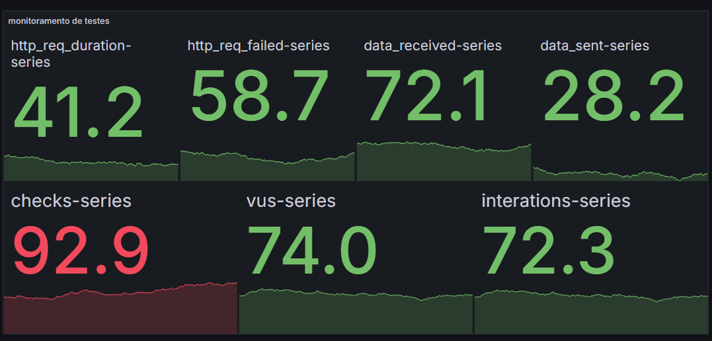
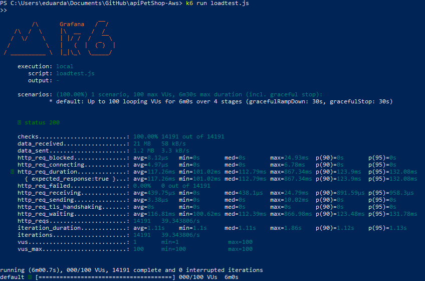

# API Pet Shop 


A API PetShop é um sistema **RESTful** desenvolvido para gerenciar informações sobre clientes e seus pets. O projeto foi construído em **Node.js**, utilizando **MongoDB** como banco de dados. Ele permite realizar operações CRUD (Criar, Ler, Atualizar e Deletar) tanto para clientes quanto para pets.

Além disso, a API suporta monitoramento e coleta de métricas através do [Prometheus](https://prometheus.io/) e oferece suporte a testes de carga utilizando o [K6](https://k6.io/).
---
## Tecnologias Utilizadas

- **Node.js**: Para o desenvolvimento do backend.
- **Express**: Framework web para criar rotas e middleware.
- **MongoDB**: Banco de dados NoSQL para armazenamento de clientes e pets.
- **Prometheus e Grafana**: Ferramentas para monitoramento e análise de métricas.
- **K6**: Ferramenta para testes de carga e desempenho
---

## 🚀 Funcionalidades

## Para Clientes
> - Criar um novo cliente.
> - Obter todos os clientes ou filtrar por nome.
> - Obter um cliente específico pelo ID.
> - Atualizar os dados de um cliente.
> - Deletar um cliente pelo ID ou nome (e todos os seus pets associados).
- ## Para Pets
> - Criar um novo pet e associá-lo a um cliente.
> - Obter todos os pets ou filtrar por nome.
> - Obter um pet específico pelo ID.
> - Atualizar os dados de um pet.
> - Deletar um pet pelo ID.
## Monitoramento
> - Expor métricas para o **Prometheus** no endpoint **/metrics**.
> - Coletar métricas padrão, como:
> - Tempo médio das requisições HTTP.
> - Taxa de requisições com falha.
> - Dados enviados e recebidos.
## Testes de Carga
> - Simular diferentes cenários de carga utilizando o **K6**.
> - Monitorar o impacto no desempenho através do painel do **Grafana**.

---

## 
# Configuração
### Pré-requisitos
- Node.js (v14 ou superior).
- MongoDB em execução.
- Prometheus e Grafana configurados.
- K6 instalado para realizar testes de carga.
# Instalação
Clone o repositório:

> ```git clone https://github.com/seu-usuario/apiPetShop-Aws.git  ```
>  ```cd apiPetShop-Aws```
## Instale as dependências:

>  ```npm install```
- Configure a conexão com o MongoDB no arquivo database.js.

## Inicie o servidor:

>  ```npm start```
- O servidor estará disponível na porta **3002** por padrão.

## Monitoramento
- Certifique-se de que o Prometheus está configurado para coletar métricas do endpoint **/metrics** da API.

No Grafana aparecerá métricas como:

- Tempo médio de requisição - (http_req_duration)
- Taxa de falhas (http_req_failed)
- Dados recebidos e enviados
- Número de usuários virtuais (vus)
- Número de interações realizadas (iterations)
# Exemplo de painel de monitoramento no grafana:


## Testes de Carga
1. Crie um arquivo de teste para o K6 (exemplo: loadtest.js):
2. Execute o teste:
> ```k6 run loadtest.js```
# Exemplo de painel do resultado:



